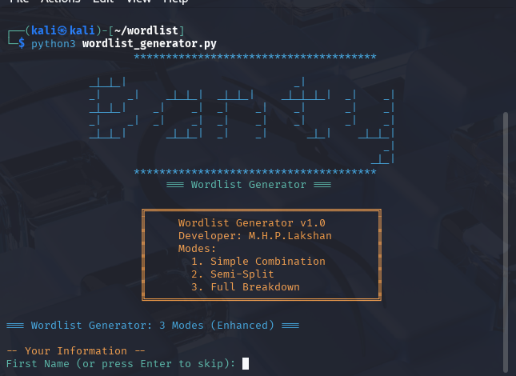

# 🔐 Banty - Wordlist Generator v1.0

A powerful, interactive wordlist generator that leverages personal information to create high-quality, customized password dictionaries — ideal for ethical hacking, penetration testing, and CTF scenarios.

  

---

## 📢 Why Use Personal Info for Wordlist Generation?

Most people use passwords based on names, dates, and contact info. This tool takes **realistic personal context** and creates diverse combinations, making it valuable for:

- Ethical hackers validating password strength
- Red teamers simulating real-world attacks
- Cybersecurity professionals running dictionary attacks in audits
- CTF players solving cracking challenges

---

## ⚙️ Key Features

### 🔁 Dynamic Wordlist Generation
Generates combinations from personal and friend info:
- First Name, Last Name, Nickname
- Birthday (Y/M/D), Email, Address, Phone
- Custom keywords and special characters

### 🧩 Three Generation Modes
| Mode | Description |
|------|-------------|
| 1    | Simple: Directly combines main inputs |
| 2    | Semi-Split: Splits some fields for more mix |
| 3    | Full Breakdown: Splits everything into words for deep permutations |

### 🧠 Smart Enhancements
- ✅ **Leetspeak variants** (e.g., `a` → `@`, `e` → `3`)
- ✅ **Uppercase and lowercase** variants
- ✅ **Phone number split** (by 2-digits)
- ✅ **Real-time progress feedback**
- ✅ **Default fallbacks** for skipped or invalid inputs

### 💾 Output & Path Handling
- Saves to `wordlist.txt` or any path you choose
- Validates directories and handles permission issues
- Shows total word count and progress updates

### 🎨 Beautiful CLI Interface

### 🔁 Repeat Support
- Option to generate multiple wordlists in a session

### 🌐 Cross-Platform Compatible
- Uses `shutil`, `os.path`, and `sys` for platform-agnostic behavior

---

## 🖥 Demo Screenshot



---

---

## 🛠️ Setup & Run Instructions

### 📌 Linux

```bash
sudo apt update
sudo apt install python3 python3-pip -y
git clone https://github.com/Lakshan2000610/wordlist.git
cd wordlist
pip3 install -r requirements.txt
python3 wordlist_generator.py

```
### 📌 Windows
```bash
git clone https://github.com/Lakshan2000610/wordlist.git
cd wordlist
pip install -r requirements.txt
python wordlist_generator.py
```
---
## 📌 Termux (Android)
```bash
pkg update
pkg install python git -y
git clone https://github.com/Lakshan2000610/wordlist.git
cd wordlist
pip install -r requirements.txt
python wordlist_generator.py

```
## license
- MIT License – free to use, modify, and share.

## 👨‍💻 Developer
- Name: M.H.P. Lakshan
- GitHub: Lakshan2000610


